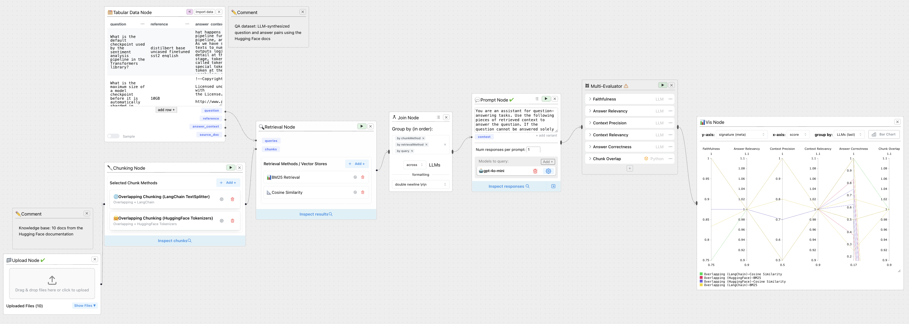

# ⚙️🛠️ RAGForge

**A visual playground for Engineering, Evaluating, and Optimizing Retrieval-Augmented Generation (RAG) Pipelines — built as a ChainForge extension.**

[](https://github.com/ianarawjo/ChainForge)



**RAGForge** extends ChainForge’s visual and modular framework to tackle the nuanced engineering challenges of Retrieval-Augmented Generation (RAG) systems. Designed for research and practical prototyping alike, RAGForge introduces a graph-based interface for constructing, visualizing, and benchmarking full RAG pipelines — from document ingestion and chunking to retrieval, prompting, and evaluation.

By abstracting each stage of the RAG process into discrete, configurable nodes, RAGForge enables systematic experimentation across retrieval strategies, chunking heuristics, and evaluation metrics. It empowers researchers to replace ad-hoc code with reproducible, visual workflows — fostering deeper insight into how different RAG configurations influence final output quality.

Whether you're comparing retriever performance, testing chunking granularity, or evaluating output faithfulness and answer precision, RAGForge transforms the complex process of RAG tuning into a transparent, iterative, and extensible visual experience.

**Core RAG Capabilities:**

*   **Ingest Knowledge Bases:** Upload and process source documents (PDF, DOCX, TXT) to serve as the foundation for retrieval.
*   **Experiment with Text Chunking:** Visually configure and compare diverse text splitting strategies, including character-based, token-based (Tiktoken, Hugging Face), and syntax-aware methods (spaCy, NLTK TextTiling), to evaluate their impact within your RAG pipeline.
*   **Implement & Compare Retrieval Strategies:** Utilize the Retrieval Node to experiment with various methods for fetching relevant context. Systematically compare keyword-based approaches (BM25, TF-IDF), various dense vector similarity techniques (Cosine, L2, etc.), and integrations with scalable vector databases (FAISS, Pinecone, ChromaDB).
*   **Visually Construct End-to-End RAG Pipelines:** Connect Document Loaders, Chunkers, Retrievers, Prompt Templaters, Generator LLMs, and specialized Evaluators in a flexible data-flow graph.
*   **Systematically Evaluate RAG Performance:** Define parameter spaces across *any* component (chunk size, overlap, retrieval method, prompt template, generator model settings) and execute combinatorial experiments.
*   **Utilize RAG-Specific Evaluation Metrics:** Employ built-in evaluation presets (e.g., Faithfulness, Answer Relevancy, Context Precision/Relevance, Answer Correctness) within the `MultiEvalNode`, alongside LLM-as-judge capabilities (including reasoning extraction).
*   **Debug and Inspect Intermediate Stages:** Examine outputs at each step – uploaded text, generated chunks, retrieved context snippets, formatted prompts, final generations, and evaluation scores – for granular analysis and debugging.

[**Check out our launch blog post for an introduction and walkthrough!**](blog_post) It features a step-by-step tutorial using the `evaluate-rag-pipeline.cforge` example — a complete, easy-to-follow RAG pipeline covering document upload, chunking, retrieval, prompting, and evaluation.


RAGForge leverages [ReactFlow](https://reactflow.dev) for its interactive graph interface and [Flask](https://flask.palletsprojects.com/en/2.3.x/) for its backend, extending the core ChainForge architecture with RAG-centric nodes and extensible handler registries.

*(Note: RAGForge is currently under active development. Feedback is highly encouraged!)*

# Table of Contents

- [Why RAGForge?](#why-ragforge)
- [Installation](#installation)
- [Core Concepts & Major Features](#core-concepts--major-features)
    - [Modular RAG Pipeline Construction](#modular-rag-pipeline-construction)
    - [Extensible Component Registries](#extensible-component-registries)
    - [Deep Parameterization & Combinatorial Testing](#deep-parameterization--combinatorial-testing)
    - [Advanced RAG Evaluation](#advanced-rag-evaluation)
    - [Visualization & Debugging](#visualization--debugging)
- [Key RAG Components Available](#key-rag-components-available)


# Why RAGForge?

Developing robust RAG systems requires navigating a high-dimensional design space where component choices and configurations interact in complex ways. Traditional methods often involve laborious scripting and isolated component testing, hindering rapid iteration and holistic understanding. RAGForge addresses this by providing:

1.  **Holistic Visualization:** Understand and modify the entire RAG data flow, from ingestion to evaluation, in a single interface.
2.  **Systematic Experimentation:** Move beyond anecdotal testing to rigorously quantify the impact of parameter changes across the full pipeline using combinatorial execution.
3.  **Integrated RAG Evaluation:** Implement and track crucial RAG metrics (Faithfulness, Context Relevance, etc.) directly within the experimental workflow using dedicated evaluation nodes and presets.
4.  **Reproducibility & Sharing:** Save, load, and share complete RAG pipeline configurations and experimental setups (`.rforge` files), ensuring reproducibility.
5.  **Rapid Prototyping & Comparison:** Easily swap different chunking methods, retrieval strategies (once expanded), or LLMs to benchmark performance within the same workflow.
6.  **Extensibility:** Designed with registries for chunking and retrieval, allowing straightforward addition of custom methods via Python handlers and schema definitions.

# Installation

**Note:** RAGForge is currently available as a development fork. Installation involves cloning the repository and running the frontend and backend components locally.
**Prerequisites:**
*   Git
*   Python 3.9 or higher
*   Node.js (v16 or higher recommended) and npm
*   `pip` package manager (usually comes with Python)

**Local Development Setup Steps:**

1.  **Clone the Repository:**
    ```bash
    git clone https://github.com/MkYacine/ChainForge.git
    cd ChainForge     # Navigate into the cloned project folder
    ```

2.  **Set up the Backend (Python):**
    *   **(Recommended)** Create and activate a Python virtual environment:
        ```bash
        python -m venv venv
        # On Linux/macOS:
        source venv/bin/activate
        # On Windows:
        # venv\Scripts\activate
        ```
    *   Install the Python dependencies in *editable* mode. This links the installation to your local source code, so changes are reflected immediately.
        ```bash
        pip install -e .
        ```
    *   *Note:* This installs the core dependencies. Some components (like specific vector stores or chunking libraries) might require additional packages. Install them as needed using `pip install <package-name>` (e.g., `pip install chromadb pinecone-client`).

3.  **Set up the Frontend (React):**
    *   Navigate to the frontend directory:
        ```bash
        cd chainforge/react-server
        ```
    *   Install the Node.js dependencies:
        ```bash
        npm install
        ```

4.  **Run RAGForge:**
    *   You need **two separate terminals** running concurrently.
    *   **Terminal 1: Run the Backend Server:**
        *   Make sure you are in the main project directory (where the `setup.py` file is).
        *   Ensure your virtual environment (if created) is active.
        *   Start the Flask backend server (using the original ChainForge command):
            ```bash
            chainforge serve
            ```
        *   By default, this usually runs on `http://localhost:8000`.
    *   **Terminal 2: Run the Frontend Development Server:**
        *   Navigate to the frontend directory (`chainforge/react-server`).
        *   Start the React development server:
            ```bash
            npm start
            ```
        *   This usually opens automatically in your browser at `http://localhost:3000` and proxies API requests to the backend server running on port 8000.

5.  **Access RAGForge:**
    *   Open your browser (Google Chrome, Firefox, Edge, Brave recommended) and navigate to `http://localhost:3000` (the frontend development server address).

**API Keys and Configuration:**
Configure LLM API keys (OpenAI, Anthropic, etc.) and other settings via the Settings panel (⚙️ icon) in the UI. Using environment variables for keys is highly recommended for security and convenience.


# Core Concepts & Major Features

RAGForge extends ChainForge's visual programming paradigm with features tailored for rigorous RAG development:

## Modular RAG Pipeline Construction
*   **Visual Graph Interface:** Intuitively drag, drop, connect, and configure RAG-specific nodes (`Upload`, `Chunking`, `Retrieval`, RAG Evaluators).
*   **Standardized Data Flow:** Nodes operate on defined inputs/outputs (e.g., text strings, lists of Document chunks, evaluation scores), ensuring interoperability.

## Extensible Component Registries
*   **Backend Registries:** RAGForge utilizes Python-based registries (`chunk_handlers.py`, `retrieve_handlers.py`) for chunking and retrieval logic.
*   **Easy Customization:** Add new chunking or retrieval methods by:
    1.  Defining a schema for configuration options in the corresponding frontend `...Schemas.tsx` file.
    2.  Implementing the logic in a Python handler function within the corresponding backend `...handlers.py` file.
    3.  Registering the handler using the appropriate decorator (`@register_chunk_handler` or `@register_retrieve_handler`). *(Future work aims to enable UI-based addition similar to custom LLM providers)*.

## Deep Parameterization & Combinatorial Testing
*   **Parametrize Any Setting:** Use `Input Nodes` to inject lists of values (file paths, chunk sizes, model names, prompts, queries, `k` values) into any node's configuration field.
*   **Cross-Product Execution:** RAGForge automatically executes the entire pipeline for every unique combination of input parameters, enabling exhaustive exploration of the design space.
*   **Enhanced `Join Node`:** Supports grouping data streams by multiple variables, critical for organizing and aligning results from complex, multi-parameter RAG experiments before evaluation or visualization.

## Advanced RAG Evaluation
*   **`MultiEval Node` RAG Presets:** Pre-configured evaluators for common RAG metrics:
    *   Faithfulness / Groundedness
    *   Answer Relevancy
    *   Context Precision / Relevance
    *   Answer Correctness (requires ground truth)
    *   *(List any other specific presets added)*
*   **`LLMEval Node` Enhancements:**
    *   **"Reason Before Scoring":** Option for the evaluator LLM to output its reasoning chain before the score, which RAGForge parses. Enhances transparency and aids in debugging evaluations.
*   **Downstream Evaluation Flow:** The `MultiEval Node` now outputs structured scores that can be directly consumed by `Vis Nodes` for plotting or `Inspect Nodes`.
*   **Custom Python Evaluators:** Retains the flexibility to write arbitrary Python code for bespoke evaluation logic targeting any data point within the flow.

## Visualization & Debugging
*   **Intermediate Inspection:** Attach `Inspect Nodes` to any node's output handle to view the data at that stage (raw text, chunk list details, retrieved document content, scores).
*   **Plotting Nodes (`Vis Node`):** Visualize evaluation scores (from `MultiEval Node`) across different parameter combinations using histograms, scatter plots, box plots, etc.
*   **Tabular Export:** Export comprehensive results (parameters, intermediate data, final outputs, evaluation scores) to `.csv` or `.xlsx` for external analysis.

# Key RAG Components Available

RAGForge provides the building blocks for RAG pipelines:

*   **Document Loading:**
    *   `Upload Node`: Handles `.txt`, `.pdf`, `.docx` file uploads directly via the UI.

*   **Text Splitting / Chunking:**
    *   `Chunking Node`: Orchestrates text splitting using various strategies.
    *   **Supported Handlers:**
        *   `overlapping_langchain`: Recursive character splitting (via LangChain).
        *   `overlapping_openai_tiktoken`: Overlapping token splitting (via Tiktoken).
        *   `overlapping_huggingface_tokenizers`: Overlapping token splitting (via Hugging Face Transformers).
        *   `syntax_spacy`: Sentence splitting (via spaCy).
        *   `syntax_texttiling`: Topic-based segmentation (via NLTK TextTiling).
    *   Extensible via the backend `ChunkingMethodRegistry`.
 
*   **Embedding Generation:** *(Used by dense retrieval methods)*
    *   **Embedding Registry:** Manages different embedding model providers.
    *   **Supported Models/Providers:**
        *   `huggingface`: Supports various Hugging Face transformer models (e.g., Sentence Transformers).
        *   `OpenAI Embeddings`: Uses OpenAI's embedding API.
        *   `Cohere Embeddings`: Uses Cohere's embedding API.
        *   `Sentence Transformers`: Uses the `sentence-transformers` library directly.
    *   *(Note: Currently invoked internally by retrieval nodes.*
*   **Retrieval:**
    *   `Retrieval Node`: Retrieves context chunks based on a query using various methods.
    *   **Supported Handlers:**
        *   **Lexical/Sparse Methods:**
            *   `bm25`: Okapi BM25 ranking.
            *   `tfidf`: TF-IDF vector similarity.
            *   `boolean`: Requires a minimum number of query term matches.
            *   `overlap`: Ranks by simple keyword overlap count.
        *   **Dense Similarity Methods (Require Embeddings):**
            *   `cosine`: Cosine similarity between embeddings.
            *   `manhattan`: Manhattan distance (L1) between embeddings (converted to similarity).
            *   `euclidean`: Euclidean distance (L2) between embeddings (converted to similarity).
            *   `clustered`: Weighted combination of query-chunk and chunk-cluster center similarity.
        *   **Vector Store Integrations:**
            *   `faiss`: Uses FAISS index (via LangChain). Supports L2/IP metrics, load/create modes, persistence.
            *   `pinecone`: Uses Pinecone cloud vector store. Supports Cosine/L2/DotProduct metrics, load/create modes, namespaces.
            *   `chromadb`: Uses ChromaDB. Supports Cosine/L2/IP metrics, in-memory/persistent modes.
    *   Extensible via the backend `RetrievalMethodRegistry`.

*   **Generation:**
    *   `LLM Chat Node` / `Prompt Node`: Standard ChainForge nodes for prompting LLMs. Supports OpenAI, Anthropic, Google, Ollama, Azure, Bedrock, etc. (Inherited from ChainForge).

*   **Evaluation:**
    *   `MultiEval Node`: With specific RAG presets (Faithfulness, Relevance, etc.).
    *   `LLMEval Node`: With "Reason Before Scoring" capability.
    *   `Script Eval Node`: For custom Python evaluations.

*   **Utility:**
    *   `Join Node`: Enhanced with multi-variable grouping.
    *   `Inspect Node`, `Vis Node`, `Text Input Node`, etc. (Inherited from ChainForge).
